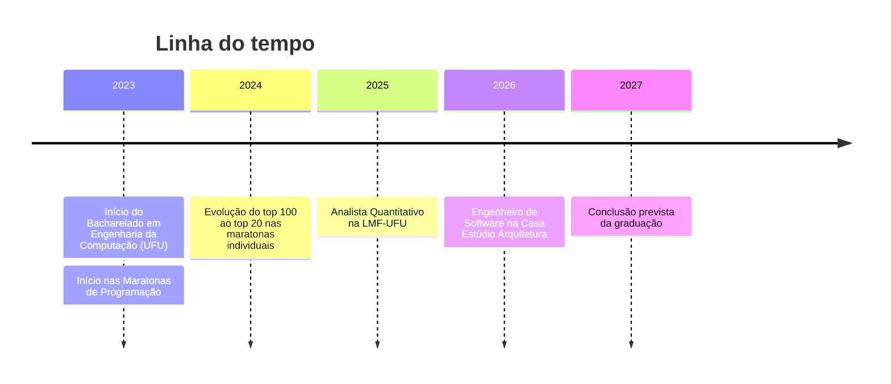

<!--
  COMO ATIVAR ESTE README NO SEU PERFIL DO GITHUB
  1. Crie um repositório público com o MESMO nome do seu usuário: iwillfilho/iwillfilho
  2. Copie este arquivo para a raiz desse repositório com o nome README.md
  3. Faça o commit — o conteúdo aparecerá automaticamente em https://github.com/iwillfilho
-->

  

  

  📍 Uberlândia, Minas Gerais — Brasil

  
  
  

---

### 🧭 Navegação

[Sobre mim](#sobre) • [Competências](#competencias) • [Soft skills & Idiomas](#softskills) • [Trajetória](#trajetoria) • [Experiência](#experiencia) • [Formação](#formacao) • [Estatísticas](#estatisticas)

---

## 🙋 Sobre mim

Sou estudante de **Engenharia da Computação na Universidade Federal de Uberlândia (UFU)**. Meus interesses principais são **análise de dados**, **finanças quantitativas** e **resolução de problemas com algoritmos**.

- 📊 Sou **Analista Quantitativo** na Liga do Mercado Financeiro (LMF-UFU), onde desenvolvo modelos de previsão em Python
- 🏗️ Trabalhei com **análise de dados e IA** num projeto de construção de um hospital na República Democrática do Congo
- 🏆 Participei de **maratonas de programação** e subi do top 100 para o **top 20** nas competições individuais
- 🧑‍🏫 Dou aulas de **Python** sobre análise de dados, machine learning e estratégias quantitativas
- 🌱 Também estudo sistemas embarcados, redes de computadores e inteligência artificial

---

## 🛠️ Competências Técnicas

  <a href="https://skillicons.dev">
    
     
    
  </a>

| Categoria | Tecnologias |
|:--|:--|
| 💻 **Linguagens** |      |
| 🌐 **Web** |      |
| 📈 **Dados & Finanças** |    |
| ⚙️ **DevOps & Infra** |     |
| 🧰 **Ferramentas** |     |

<b>🔍 Onde já apliquei cada competência (clique para expandir)</b>

 

| Competência | Aplicação prática |
|:--|:--|
| **Python** | Modelos de previsão de preços de ações (LMF-UFU), análise de dados no projeto O.T.A. (Casa Estúdio), aulas para o núcleo quantitativo |
| **C/C++** | Algoritmos e estruturas de dados avançadas em maratonas de programação |
| **Análise de Dados & IA** | Projeto O.T.A. para um hospital na RD Congo; estratégias quantitativas na LMF-UFU |
| **Finanças** | Valuation da Ambev por fluxo de caixa descontado (DCF) e múltiplos |
| **Desenvolvimento de Software** | Ferramentas de organização de tarefas que economizaram cerca de 2h/dia de cada arquiteto |
| **Hardware & SO** | Manutenção, backups e formatação de máquinas Windows e macOS |

---

## 🤝 Soft Skills & Idiomas

  
  
  
  
  

| Idioma | Nível |
|:--|:--|
| 🇧🇷 Português |  |
| 🇺🇸 Inglês |  |
| 🇪🇸 Espanhol |  |

---

## 🗺️ Trajetória

---

## 💼 Experiência & Liderança

> Clique em cada item para ver os detalhes.

<b>🏗️ Engenheiro de Software</b> — Casa Estúdio Arquitetura · <i>Jul 2026 – Set 2026 · Araguari, MG</i>

 

- Trabalhei com **análise de dados em Python e ferramentas de IA** num projeto de **O.T.A. (Owner's Technical Advisor)** para a construção de um hospital na **República Democrática do Congo**.
- Desenvolvi **softwares de organização de tarefas e arquivos** que economizaram **cerca de 2 horas por dia** no trabalho de cada arquiteto.
- Cuidei da **manutenção de hardware** dos computadores da empresa, incluindo backups e formatação em Windows e macOS.

`Python` `IA` `Análise de Dados` `Automação` `Windows` `macOS`

<b>📊 Analista Quantitativo</b> — Liga do Mercado Financeiro (LMF-UFU) · <i>Dez 2025 – Atual · Uberlândia, presencial</i>

 

- Fiz com a equipe o **valuation da Ambev** usando **fluxo de caixa descontado (DCF)** e **múltiplos**. A previsão **se confirmou** nos meses seguintes, com a valorização das ações.
- Dei **aulas de Python** aos membros do núcleo quantitativo sobre análise de dados, aprendizado de máquina e estratégias quantitativas.
- Desenvolvi em equipe **modelos de previsão de preços de ações** com estratégias quantitativas em Python.

`Python` `Valuation` `DCF` `Machine Learning` `Finanças Quantitativas` `Ensino`

<b>🏆 Participante</b> — Maratonas de Programação · <i>Ago 2023 – Dez 2024 · Uberlândia, presencial</i>

 

- Competi em **2 maratonas individuais** e **4 maratonas em equipe**.
- Resolvi problemas complexos com **algoritmos e estruturas de dados avançadas** em **C/C++ e Python**.
- Nas maratonas individuais, saí do **top 100** e cheguei ao **top 20**.

`C/C++` `Python` `Algoritmos` `Estruturas de Dados` `Trabalho em Equipe`

---

## 🎓 Formação

<b>Universidade Federal de Uberlândia (UFU)</b> — Bacharelado em Engenharia da Computação · <i>Ago 2023 – Ago 2027</i>

 

- Aprendi linguagens de programação e desenvolvimento de software com excelentes docentes.
- Tive teoria e prática em **circuitos elétricos e digitais**, **sistemas embarcados**, **inteligência artificial** e **redes de computadores**.
- Desenvolvi comunicação e trabalho em equipe em vários projetos acadêmicos e extracurriculares.

---

## 📈 Estatísticas do GitHub

  
  

  

---

  

  

